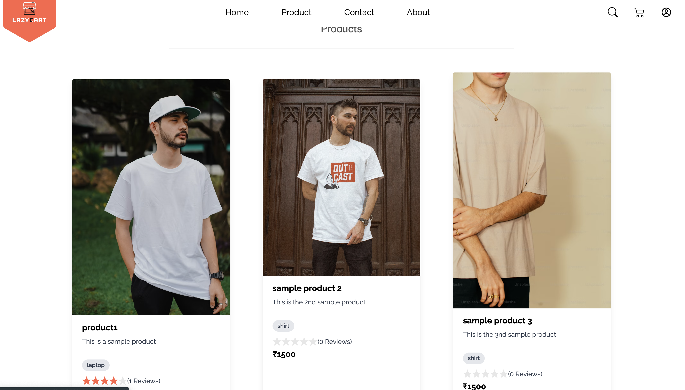
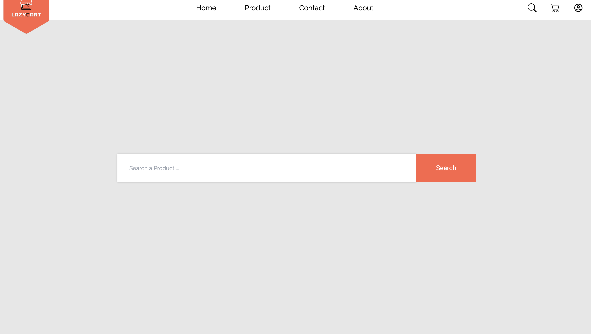

# LazyCart

This is a full-stack ecommerce website built using the MERN stack (MongoDB, Express.js, React.js, Node.js) and Tailwind CSS. The website provides various features such as user authentication, product listing, shopping cart, search functionality, pagination, payment integration, and more.

## Features

- User Registration and Authentication:
  - Sign up using email and password.
  - Log in with email and password.
  - Forgot password functionality to reset password via email.

- Product Listing:
  - Display a list of products with details such as name, price, description, and images.
  - Categorize products into different categories for easy navigation.

- Shopping Cart:
  - Add products to the cart.
  - Update quantity or remove items from the cart.
  - Calculate the total price of items in the cart.

- Search Functionality:
  - Search for products based on keywords or categories.

- Pagination:
  - Display products in multiple pages for better performance and user experience.

- Payment Integration:
  - Integrate with a payment gateway to allow users to make payments for their orders.
  - Provide a secure and seamless payment process.

## Tech Stack

The project is built using the following technologies:

- **MongoDB**: A NoSQL database used to store product and user data.
- **Express.js**: A Node.js framework used for building the backend API.
- **React.js**: A JavaScript library used for building the frontend user interface.
- **Node.js**: A JavaScript runtime environment used for server-side scripting.
- **Tailwind CSS**: A utility-first CSS framework used for styling the website.

